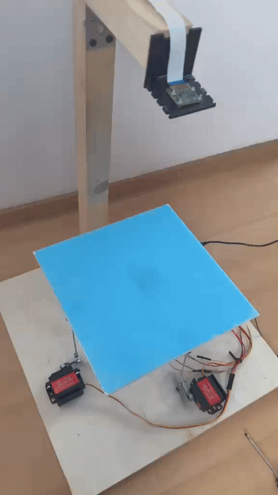
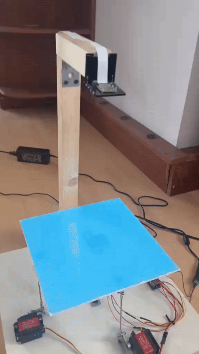

# Ball-on-Plate Control System

Ball-on-Plate stabilization system with model-based control and base tilt compensation.

## Project overview

Master's thesis project focused on stabilizing a ball on a two-axis platform using a mathematical model, computer vision and LQR control.

The system uses an IMU sensor to measure platform orientation and compensates for base tilts affecting the ball motion.

The solution was tested both in simulation and on a physical prototype.

## Demo

### Stabilization demo



### Alternative stabilization view



## Key features

- Mathematical modeling of the Ball-on-Plate system
- Computer vision ball tracking
- LQR-based position control
- IMU-based tilt measurement
- Base tilt compensation
- Two-axis servo control
- Simulation and real-world testing

## Hardware

### Control system

- Raspberry Pi 4B
- PCA9685 servo driver
- Two MG996R servo motors
- 5 V / 10 A power supply

### Measurement system

- Raspberry Pi Camera Module 2
- MPU6050 IMU

### Mechanical components

- Ball joints
- Linkage rods
- Servo mounting brackets
- Central ball joint

## Software & libraries

- Python
- OpenCV
- Picamera2
- NumPy
- SciPy
- Adafruit ServoKit
- SMBus2

## Control methods

- LQR control
- Model-based control
- Base tilt compensation

## Project structure

```text
src/
├── main.py        # Main application loop
├── control.py     # Mathematical model and LQR control
├── vision.py      # Ball detection using computer vision
├── imu.py         # MPU6050 reading for base tilt compensation
├── hardware.py    # Servo and PCA9685 control
├── utils.py       # Helper functions
└── __init__.py

requirements.txt   # Python dependencies
